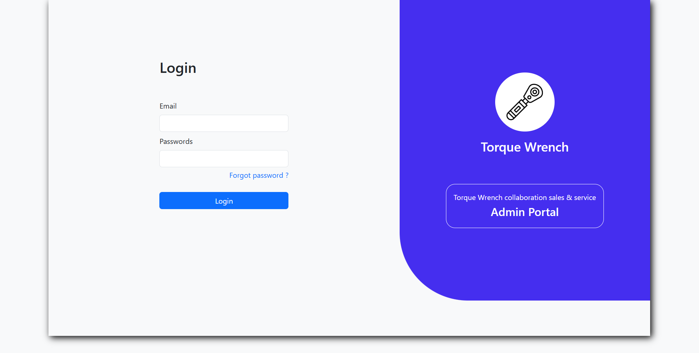

# 

Torque Wrench Login Page Design
===============================

📌 Overview:
------------
This is a responsive and modern login page UI design for the "Torque Wrench" Admin Portal. The layout is clean and professional, intended for use in a web application for managing torque wrench collaboration, sales, and service.

🎨 Features:
-----------
- Split screen design with login form on the left and brand section on the right
- Logo/icon section with product name and portal description
- Email and password input fields
- "Forgot password?" link
- Stylish login button
- "Admin Portal" button for navigation

🛠️ Technologies Suggested (for Implementation):
----------------------------------------------
- HTML5 for structure
- CSS for styling

📁 Files:
--------
- `index.html` – main structure of the login page
- `style.css` – all custom styles 
- `assets/images` – folder to store icons and images (e.g., torque wrench icon)

🧪 Usage:
--------
1. Clone the repository
2. Open `index.html` in your browser
3. Customize text, branding, or links as needed

📷 Screenshot:
--------------

